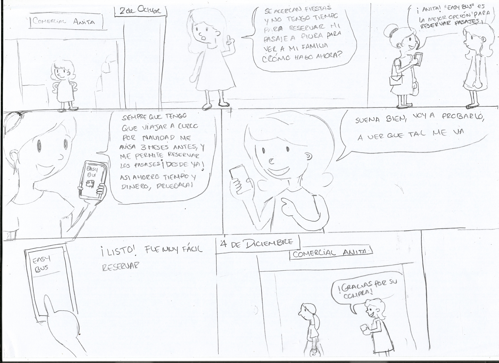

# **RETO UX : NUEVA EXPERIENCIA EN EMPRESAS DE BUSES**  

>Track: Common Core.  
Unidad: Primer proyecto Ux.  

### **Planteamiento del problema**  
Nos ha contactado Catalina una emprendedora viajera con una idea de negocio. Durante sus últimas vacaciones Catalina estuvo viajando por todo latinoamérica. Durante estos viajes Catalina tuvo que tomar muchos buses de todo tipo para llegar a ver los paisajes más lindos del continente. Durante sus viajes Catalina se dio cuenta que existen aún muchas oportunidades para mejorar la experiencia de todos los usuarios de este tipo de transporte: horarios, embarques, desembarques, compra de tickets en los terminales, compra de tickets online, cancelaciones, cambios de pasajes, etc. Adicionalmente, Catalina se dio cuenta que todas las plataformas de venta de tickets de bus tienen cosas por mejorar en Chile, Perú y México.  

*Dado este contexto.*

→ **¿Cómo hacer para crear un producto que mejore la experiencia en empresas de buses?**  

# ***DESARROLLO DEL PROYECTO***

#### Día 1 

### **PLANIFICACION** 

  
#### Día 1 :
  - Planificación del trabajo.  
  - Planteamiento de preguntas a usuarios.
    - 10 Preguntas (Online/Presencial).

#### Día 2 :  
- **Ux Research** : Entrevistas a usuarios.  

  - Horario de encuentro del grupo para la entrevista 9:00am.  
  - Primer punto de la entrevista Av.Javier Prado,empresa Movil Tours y Cruz del Sur.(2p)  
  Segundo punto de la entrevista Av.28 de Julio diversas empresa de transporte.(3p)  
  - Participamos todas.  
  - 20 Personas a entrevistar aproximadamente.  

-  **Análisis de Usuario**  : Analizando la información recaudada.

    - Punto de encuentro Laboratoria 12:00pm para reunir todas la información recaudada.
    - Realizar un mapa de afinidad o lluvia de ideas para detectar las necesidades del usuario.
    - Investigar empresas del mismo rubro.  

#### Día 3 :  
-  **Mapa de afinidad**
      - Realizar un mapa de afinidad o lluvia de ideas para detectar las necesidades del usuario.
      - Priorizar y decidir qué problemática vamos a abordar.  
      - Hacer un benchmark y buscar referencias relacionadas a el problema.  

#### Día 4 :
- **Presentación del problema** : Presentación en clase y feedback del problema a tratar.
    - Explicación de los temas encontrados en el diagrama de afinidad.  
    - ¿Cómo priorizaron y seleccionaron el problema de su squad?  
    - Presentación del problema a abordar.  

#### Día 5:  
- **User personas y Brainstorming**
    - Crear un user persona para entender mejor las metas, deseos y limitaciones de los principales grupos de usuario de nuestro producto.  
    - Elaborar los problem statements del caso ya que nos ayudaran a centrarnos en resultados y no en productos.  
    - Escribir HMW y what if? para así entender mejor los problemas y desarrollar mejores hipótesis.  
    - Hacer una lista de funcionalidades que pueden resolver los HMW.  
- **Definir el MVP**
    - Priorizar lista de features y definir el MVP.  
    - Hacer un storyboard y recibir feedback.  

#### Día 6:
- **Testeo**
     - Hacer un content prototype.  
     - Testearlo en pareja con compañeras de otro squad.
     
#### Día 7:
- **Exposicion final**
     - Testeo del prototype a diferentes personas.
     
#### Día 8:
- **Exposicion final**
     - Testeo del la ultima versión del prototype.
     - Presentación final del prototype.  
     
# 

#### Día 2

## **UX RESEARCH Y ANALISIS DE USUARIO.**

## **Encuestas presenciales.**

  

- Entrevistamos a 26 personas de entre 22 y 60 años para evaluar sus necesidades.
- Localización:
   - Punto 1: Av. Javier Prado Este – Lima: Agencias de Transporte Terrestre.
   - Punto 2: Av.28 de Julio –La Victoria: Agencias de Transporte Terrestre.
- Grabamos las entrevistas de los usuarios para centrarnos en el lenguaje corporal.  

### **Preguntas:**

1. ¿Alguna experiencia buena o mala con los servicios que ofrece
 la empresa de buses?

2. ¿A su parecer cuál es el mayor problema que tienen las empresas de transporte (Embarque, Desembarque, Compra de pasajes, Cambio de boletos u otros inconvenientes)?  

3. ¿Qué es lo que más se le dificulta al momento de elegir su horario de viaje?

4. ¿Por qué motivos viaja?

5. ¿Cómo elige en que empresa viajar?

6. ¿Qué tan sencillo consideras el proceso de reserva de pasajes en la empresa de buses?

7. ¿Con qué frecuencia viaja?

8. ¿Cuál es el presupuesto que invierte en la compra de su pasaje?

9. Usted compra sus boletos de manera presencial o vía web?

10. ¿Cuál es el problema más recurrente al viajar en festividades?

#### **Respuesta de uno de los entrevistados:**

  - *Viajo por motivos familiares.*   
  - *Siempre viajo por confianza.*  
  - *Separo mi boleto de manera presencial.*  
  - *Aproximadamente 100 soles.*  
  - *El precio se incrementa de los pasajes.*

#### **Según las encuestas que realizamos el 60% de las personas nos indican que desean :**  

- Rapidez en la venta de pasajes.  
- Que la empresa de buses en la que viajaran sea cómoda y económica.  
- Habilitar mas pasajes y mas buses por que no se dan abasto.   
- Eligen a la empresa en la que viajaran por que hay mucha seguridad.  
- Eligen a la empresa de buses en la que viajaran por ser conocida y recomendada.

## **Encuestas on-line.**
Se encuesto a 39 personas de entre 20 a 52 años para averiguar sus necesidades así como también los problemas más frecuentes al viajar en bus.

  

#### Día 3 
## **DIAGRAMA DE AFINIDAD**

Se desarrolló el análisis de las encuestas realizadas para poder recopilar toda la información y los problemas encontrados.

Empleamos el **Diagrama de Afinidad** para poder identificar  y clasificar los diversos problemas encontrados.

Se consideró clasificar los problemas por temas.

Por ejemplo :

 Servicios, frecuencia de viaje, formas de pago, precios, etc.

#### Día 4 
## **PRESENTACIÓN DEL PROBLEMA**

Temas encontrados en el diagrama de afinidad.

-	Falta de información (problemas en la carretera, información en tiempo real de precios y disponibilidad de pasajes.)
-	No cumplen con el servicio que ofrecen, el precio no va acorde con el servicio que dan.
-	El incremento del precio del pasaje en temporada alta.
-	El maltrato de maletas.
-	La falta de capacitación del personal.
-	La infraestructura de la empresa no es buena (baños y cafetería sucios)
-	No respetan los horarios, al momento de embarcar.

Después de analizar  las entrevistas presenciales y las encuestas on-line y haber realizado en grupo el diagrama de afinidad, se tomó la decisión de abarcar el siguiente problema:

    El incremento de los pasajes en festividades y la falta de información.

#### Día 5 
## **USER PERSON, PROBLEM STATEMENT, HMW, WHAT IF y STORYBOARD**

Con la información obtenida en las entrevistas, ahora tenemos que definir a nuestro USER PERSONA.

- **Problem Statement**
  1. Ana quisiera viajar en una empresa que brinde seguridad en base a la recomendación de otras personas.
  2. Ana necesita reservar sus pasajes para economizar más.
  3. Ana necesita recordar las fechas exactas de feriados u otros acontecimientos para la reserva de su pasaje.
  4. Ana necesita ser informada para comprar sus pasajes a tiempo.
  5. Ana necesita alternativas de precios de pasajes para elegir el que le conviene.

- **HMW – How Might We?**
  - ¿Cómo podríamos ayudar a Ana a reservar sus pasajes con anticipación?
  - ¿Cómo podríamos ayudar a Ana a economizar?
  - ¿Cómo podríamos brindarle sugerencias a Ana sobre en qué empresa debe viajar?

- **Whats if?**
  - ¿Qué tal si hablo con empresas para que no suban los precios por fiestas?
  - ¿Qué tal su Ana no sabe utilizar la app?
  - ¿Qué tal si Ana no tiene un Smartphone?
  - ¿Qué tal si la agencia le reservará un asiento a Ana por fiestas?

## **STORYBOARD**

#### Día 6 
## **PROTOTYPING CONTENT**

Se realizó  un primer content prototype, en el cual recibimos feedback de otro squads, y nos ayudo a: 

- Analizar  que contenido era necesario ponerle.
- Hacer un mejor content prototype.
- A empezar a tener una noción tangible de nuestro proyecto

##

#### Content prototype final

#### EASY BUS

Hola Ana Rodriguez

"Bienvenida a Easy Bus!

- Disfruta de los Feriados y Festividades sin pagar más por tu pasajes.

    - *Permitir el uso de GPS para la ubicación.*

- Por el mes de Marzo :

    - Viaja a Ayacucho por Semana Santa,  compra ahora y ahorra 30% en tus pasajes.

    - Viaja a Huancayo para el Carnaval Jaujino , compra ahora y ahorra 25% en tus pasajes.

    - Viaja a Cuzco por Semana Santa, compra ahora y ahorra 35% en tus pasajes.

- Al usuario se le muestra una imagen por festividad o feriados que se  aproximan.

*(Elige viajar a Ayacucho por Semana Santa)*

- A Ayacucho, puedes viajar con las siguientes empresas:

    -	Cruz del Sur - 10 pasajes disponibles

    -	Civa - 8 pasajes disponibles

    -	Oltursa – 12 pasajes disponibles

    -	Movil Bus – 5 pasajes disponibles

- Para continuar es necesario registrarte o iniciar tu sesión con Facebook o Google.

*(Elige iniciar sesión con Facebook)*

- Se muestra el mes que viene o se puede elegir otro mes en adelante para ver feriados o festividades que habrá.

   •	Marzo  
   •	Abril  
   •	Mayo  
   •	Junio  

*(Elige Marzo)*

- Se visualizará las festividades que habrá en el mes de Marzo.

   •	Semana Santa
   •	Carnaval Jaujino

*(Elige carnaval Jaujino)*

- Te conviene comprar o reservar tus pasajes en estas fechas

Del 1  al 5 de marzo  
Tu destino es para Huancayo.  
Estas son las empresas que te llevan a tu destino, recuerda que la disponibilidad de asientos es limitada.

    Cruz del Sur : 5 pasajes disponibles
   	Civa : 8 pasajes disponibles
  	Oltursa : 11 pasajes disponibles
  	Movil Bus : 5 pasajes disponibles

*(Elige Cruz del Sur)*

- Te damos la opción:

	 - Comprar
   - Reservar

- ¡Excelente Ana!!, ahora:

   - Ingresa la siguiente información para la compra de tu pasaje:
      - DNI: 12324353
      - Nombre(s) :Ana
      - Apellidos :Rodriguez Varela.
      - Edad: 35 años
      - Sexo:
         - F
         - M
       - Asiento: 36

       Total:S/. 120.00

  *(Elige pagar)*

- ¡Listo!

   Te estaremos enviando la confirmación de tu pasaje a tu correo electrónico.

    Acabas de ahorrar:

     Pasaje normal en temporada alta: S/ 160.00
     Pasaje comprado :S/.120.00

     Ana ahorraste S/.40.00 con Cruz del Sur.

- GRACIAS por usar EasyBus !!

#### Primer testeo entre squads

#### Día 7

## **PROTOTYPING ANTERIORES Y TESTEO**

Diversos prototipos, realizados para mejorar el flujo de la aplicación.

La primera versión 

Testeó a diversas personas que nos ayudaron a implementar un mejor prototipo.

#### Día 8

## **PROTOTYPING FINAL**

Flujo en caso decida reservar:

Link de la presentación final

https://drive.google.com/file/d/1gDOwBtsRr9rSs0PK8-26sArjU-IS6jA8/view
